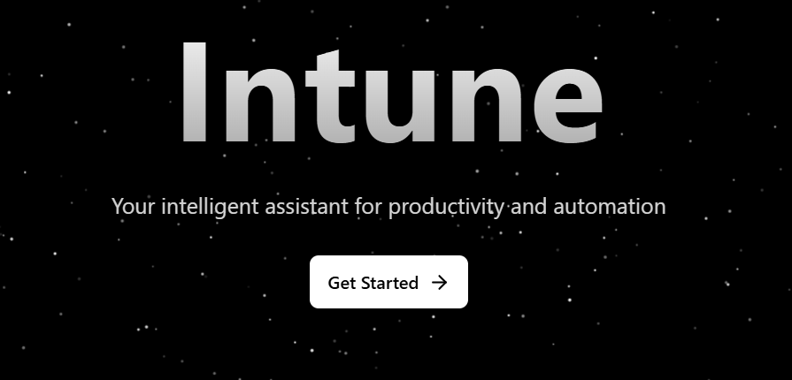

# Self-Improving LLM Evaluation Framework

An end-to-end framework for training, evaluating, and iteratively improving Large Language Models with automated feedback loops.

[](https://www.python.org/downloads/)
[](https://fastapi.tiangolo.com/)
[](LICENSE)
[]()

---

## Team Members

| Name                      | Roll Number |
|---------------------------|-------------|
| Radhakrishna Bharuka      | 24BDS063    |
| Abhang Pawar              | 24BDS054    |
| Nilesh Dwivedi            | 24BDS048    |
| Rushikesh Masalkar        | 24BDS040    |

---

## Table of Contents

- [Overview](#overview)
- [Demo Video](#demo-video)
- [Features](#features)
- [System Architecture](#system-architecture)
- [Repository Structure](#repository-structure)
- [Installation Process](#installation-process)
- [Execution Guide](#execution-guide)
- [Evaluation Metrics](#evaluation-metrics)
- [API Documentation](#api-documentation)
- [Technology Stack](#technology-stack)
- [Documentation](#documentation)
- [License](#license)

---

## Overview

This framework implements a self-improving Large Language Model system that:

- Automatically collects training data from user interactions
- Evaluates model quality using 8 comprehensive metrics
- Fine-tunes models using efficient LoRA (Low-Rank Adaptation) adapters
- Measures improvements quantitatively with before/after comparisons
- Operates continuously with background workers
- Scales efficiently on consumer GPUs (8GB VRAM minimum)

---

## Demo Video

**2-Minute Working Demo**

[](https://github.com/Self-eval-llm/Intune-Backend/blob/main/docs/demo_video.mp4)

**[Click here to watch the full demo video](https://github.com/Self-eval-llm/Intune-Backend/blob/main/docs/demo_video.mp4)**

The demo video demonstrates:
- User interactions through the chat interface
- Real-time response generation from the model
- Background evaluation workers computing metrics
- Fine-tuning process triggering automatically
- Before and after comparison of model improvements

---

## Features

### Automated Training Pipeline
- Continuous data collection from user interactions
- Automatic dataset preparation and validation
- Threshold-based fine-tuning trigger (configurable)

### Comprehensive Evaluation System
- 8 distinct quality metrics for thorough assessment
- Before and after comparison reports
- Real-time metric computation

### Efficient Fine-tuning
- LoRA-based fine-tuning for memory efficiency
- Runs on consumer GPUs with 8GB+ VRAM
- Checkpoint saving every 100 steps

### Background Workers
- Asynchronous metric computation
- Automated fine-tuning workflow
- Continuous monitoring and processing

---

## System Architecture

### High-Level Component Diagram

```
┌─────────────────────────────────────────────────────────────────┐
│                   SELF-IMPROVING LLM FRAMEWORK                  │
│                                                                 │
│  ┌──────────────┐         ┌──────────────┐         ┌──────────────┐
│  │   FRONTEND   │◄───────►│   BACKEND    │◄───────►│   DATABASE   │
│  │  (React/Vue) │  REST   │   (FastAPI)  │  SQL    │  (Supabase)  │
│  │              │   API   │              │         │              │
│  │  Port: 5173  │         │  Port: 8000  │         │    Cloud     │
│  └──────────────┘         └──────────────┘         └──────────────┘
│                                   │                                    
│                                   │                                    
│                          ┌────────┴────────┐                          
│                          │                 │                          
│                    ┌─────▼─────┐    ┌─────▼─────┐                   
│                    │  Worker 1  │    │  Worker 2  │                   
│                    │ eval_first │    │eval_finetune│                  
│                    │ (Metrics)  │    │ (Training) │                   
│                    └────────────┘    └────────────┘                   
│                          │                 │                          
│                          └────────┬────────┘                          
│                                   │                                    
│                          ┌────────▼────────┐                          
│                          │  OLLAMA SERVER  │                          
│                          │  Port: 11434    │                          
│                          │                 │                          
│                          │  - Gemma 1B     │                          
│                          │  - GPT-OSS 20B  │                          
│                          │  - Fine-tuned   │                          
│                          └─────────────────┘                          
└─────────────────────────────────────────────────────────────────┘
```

### Data Flow Diagram

```
┌─────────────────────────────────────────────────────────────────┐
│                    SELF-IMPROVEMENT LOOP                        │
└─────────────────────────────────────────────────────────────────┘

Step 1: USER INTERACTION
  ┌─────────────────┐
  │ User submits    │
  │ a question      │
  └────────┬────────┘
           │
           ▼
Step 2: RESPONSE GENERATION
  ┌─────────────────┐
  │ Gemma 1B Model  │
  │ generates answer│
  └────────┬────────┘
           │
           ▼
Step 3: DATABASE STORAGE
  ┌─────────────────────┐
  │ Save to Supabase    │
  │ status: 'created'   │
  └────────┬────────────┘
           │
           ▼
Step 4: FIRST EVALUATION
  ┌─────────────────────────────────┐
  │ Compute 8 metrics:              │
  │ - Answer Relevancy              │
  │ - Contextual Precision          │
  │ - Faithfulness                  │
  │ - Toxicity                      │
  │ - Overall Score                 │
  │ - And 3 more                    │
  │ status: 'done'                  │
  └────────┬────────────────────────┘
           │
           ▼
Step 5: DATA ACCUMULATION
  ┌─────────────────────┐
  │ Collect N records   │
  │ (default: 5000)     │
  └────────┬────────────┘
           │
           ▼
Step 6: FINE-TUNING
  ┌─────────────────────────────────┐
  │ Trigger at threshold            │
  │ - Prepare training data         │
  │ - Apply LoRA adapters           │
  │ - Train for 3 epochs            │
  │ - Save improved model           │
  └────────┬────────────────────────┘
           │
           ▼
Step 7: FINAL EVALUATION
  ┌─────────────────────────────────┐
  │ Re-evaluate with fine-tuned     │
  │ model and compare results:      │
  │                                 │
  │ Base Model → Fine-tuned Model   │
  │ Score: 0.65 → Score: 0.78       │
  │ Improvement: +20%               │
  └────────┬────────────────────────┘
           │
           ▼
Step 8: DEPLOY AND REPEAT
  ┌─────────────────────┐
  │ Use improved model  │
  │ for new interactions│
  │ Loop back to Step 1 │
  └─────────────────────┘
```

---

## Repository Structure

```
Intune-Backend/
│
├── .env                          # Environment variables (Supabase credentials)
├── .gitignore                    # Git ignore rules
├── Modelfile                     # Ollama model configuration
├── requirements.txt              # Core dependencies
├── requirements_finetune.txt     # Fine-tuning dependencies
├── README.md                     # This file
│
├── app/                          # APPLICATION LAYER
│   ├── app.py                    # Main FastAPI server (Port 8000)
│   ├── eval_first.py             # Worker 1: Base metrics evaluation
│   ├── eval_finetune.py          # Worker 2: Fine-tuning and final evaluation
│   └── README.md                 # API documentation
│
├── src/                          # SOURCE CODE LAYER
│   │
│   ├── data_generation/          # Data pipeline
│   │   ├── teacher.py            # Generate training examples (GPT-OSS)
│   │   ├── student.py            # Generate base outputs (Gemma)
│   │   └── prepare_data.py       # Format for training (JSONL)
│   │
│   ├── training/                 # Model fine-tuning
│   │   └── finetune.py           # LoRA-based training
│   │
│   ├── evaluation/               # Quality assessment
│   │   ├── update_metrics.py     # Compute base metrics
│   │   ├── evaluate_finetuned.py # Compare base vs tuned
│   │   ├── evaluate_ollama.py    # Test deployed models
│   │   └── generate_report.py    # Create comparison reports
│   │
│   ├── metrics/                  # Evaluation engine
│   │   └── llm_eval.py           # 8 metrics implementation
│   │
│   ├── database/                 # Database abstraction
│   │   └── supabase_client.py    # Supabase connection and utilities
│   │
│   └── utils/                    # Helper functions
│
├── docs/                         # DOCUMENTATION AND MEDIA
│   ├── AI_report.pdf             # Comprehensive project report
│   ├── AI_PPT.pptx               # Project presentation
│   ├── result.pdf                # Evaluation results
│   ├── demo_video.mp4            # Working demo video (2 minutes)
│   ├── intune_landingpage.png    # Landing page screenshot
│   ├── Full_workflow.png         # Complete workflow diagram
│   ├── basic_workflow_figma.png  # Simplified workflow
│   └── db_schema.png             # Database schema diagram
│
├── sql/                          # DATABASE SCHEMAS
│   ├── supabase_setup.sql        # Initial table setup
│   ├── supabase_add_metrics.sql  # Add metric columns
│   ├── add_tuned_columns.sql     # Add fine-tuned columns
│   └── create_decimal_view.sql   # View for decimal metrics
│
├── scripts/                      # UTILITY SCRIPTS
│   ├── convert_to_gguf.py        # Convert model to GGUF format
│   ├── create_ollama_model.py    # Create Ollama model
│   └── cleanup.ps1               # Cleanup script
│
├── config/                       # CONFIGURATION
│   └── .env.example              # Environment variables template
│
├── reports/                      # EVALUATION RESULTS
│   └── evaluation_report_*.json  # Performance comparison reports
│
└── Supabase_csv/                 # DATA EXPORTS
    └── *.csv                     # Database exports
```

### Component Responsibilities

| Component | Purpose | Key Files |
|-----------|---------|-----------|
| **app/** | API server and workers | `app.py`, `eval_first.py`, `eval_finetune.py` |
| **src/data_generation/** | Create training data | `teacher.py`, `student.py`, `prepare_data.py` |
| **src/training/** | Fine-tune models | `finetune.py` |
| **src/evaluation/** | Assess quality | `update_metrics.py`, `evaluate_finetuned.py` |
| **src/metrics/** | Scoring engine | `llm_eval.py` |
| **src/database/** | Data persistence | `supabase_client.py` |
| **docs/** | Documentation and media | PDFs, images, video |
| **sql/** | Database schemas | SQL scripts |
| **scripts/** | Utilities | Conversion and deployment tools |

---

## Installation Process

### Prerequisites

Before you begin, ensure you have the following installed:

| Requirement | Version | Purpose |
|------------|---------|---------|
| **Python** | 3.10 or higher | Core runtime |
| **NVIDIA GPU** | 8GB+ VRAM | Fine-tuning (RTX 4060 or better recommended) |
| **System RAM** | 16GB or more | Model loading |
| **Ollama** | Latest | Local LLM inference |
| **Supabase Account** | Free tier | Cloud database |
| **Git** | Latest | Clone repository |

---

### Step 1: Clone the Repository

```bash
git clone https://github.com/Self-eval-llm/Intune-Backend.git
cd Intune-Backend
```

---

### Step 2: Set Up Python Environment

**Using Virtual Environment (Recommended):**

```bash
# Create virtual environment
python -m venv .venv

# Activate virtual environment
# On Windows PowerShell:
.\.venv\Scripts\Activate.ps1

# On Windows Command Prompt:
.\.venv\Scripts\activate.bat

# On Linux/Mac:
source .venv/bin/activate

# Install dependencies
pip install -r requirements_finetune.txt
```

**Using Conda (Alternative):**

```bash
# Create conda environment
conda create -n llm-framework python=3.10

# Activate environment
conda activate llm-framework

# Install dependencies
pip install -r requirements_finetune.txt
```

---

### Step 3: Configure Environment Variables

```bash
# Copy the environment template
cp config/.env.example .env

# Edit .env file with your credentials
# On Windows: notepad .env
# On Linux/Mac: nano .env
```

**Add your Supabase credentials to `.env`:**

```env
# Supabase Configuration
SUPABASE_URL=https://your-project-id.supabase.co
SUPABASE_KEY=your-anon-or-service-key

# Optional: Model Configuration
DEFAULT_MODEL=gemma3:1b
TEACHER_MODEL=gpt-oss:20b
```

**How to get Supabase credentials:**
1. Go to [supabase.com](https://supabase.com) and create a free account
2. Create a new project
3. Navigate to **Settings** → **API**
4. Copy the **Project URL** and **anon/public key**

---

### Step 4: Set Up Database

**Run SQL scripts in Supabase SQL Editor in the following order:**

1. Open Supabase Dashboard → SQL Editor
2. Execute `sql/supabase_setup.sql` - Creates main table structure
3. Execute `sql/supabase_add_metrics.sql` - Adds metric columns
4. Execute `sql/add_tuned_columns.sql` - Adds fine-tuned metric columns
5. (Optional) Execute `sql/create_decimal_view.sql` - Creates decimal view for easier querying

**Database Schema Created:**

The `intune_db` table includes:
- `id` - Primary key
- `created_at` - Timestamp
- `input` - User question
- `actual_output` - Base model response
- `expected_output` - Reference answer
- `context` - Background information (JSONB)
- `status_eval_first` - Base evaluation status
- `status_eval_final` - Fine-tuning evaluation status
- 8 base metric columns (INTEGER, multiply by 10000)
- 8 fine-tuned metric columns (INTEGER, multiply by 10000)

---

### Step 5: Set Up Ollama

**Install Ollama:**

```bash
# Windows (using winget):
winget install Ollama.Ollama

# Or download from https://ollama.ai

# Start Ollama service
ollama serve
```

**Pull Required Models:**

Open a new terminal window and run:

```bash
# Pull base model (Gemma 1B - approximately 1.5GB)
ollama pull gemma3:1b

# Pull teacher model (GPT-OSS 20B - approximately 20GB)
# Optional, only needed for data generation
ollama pull gpt-oss:20b

# Verify installation
ollama list
```

**Expected Output:**
```
NAME              ID              SIZE      MODIFIED
gemma3:1b         abc123def       1.5 GB    2 minutes ago
gpt-oss:20b       def456ghi       20 GB     5 minutes ago
```

---

### Step 6: Verify Installation

**Test database connection:**

```bash
python -c "from src.database.supabase_client import get_supabase_client; print('Database connected!' if get_supabase_client() else 'Connection failed')"
```

**Test Ollama connection:**

```bash
curl http://localhost:11434/api/tags
```

If successful, you should see a JSON response with a list of available models.

---

## Execution Guide

The framework requires **3 separate processes** running simultaneously. Each process should run in its own terminal window.

### Terminal 1: API Server (Main Application)

```bash
# Activate virtual environment
.\.venv\Scripts\Activate.ps1

# Start FastAPI server
python -m uvicorn app.app:app --host 0.0.0.0 --port 8000 --reload
```

**What it does:**
- Serves REST API endpoints
- Handles `/generate` requests from frontend
- Manages database operations
- Provides health check endpoint

**Console Output:**
```
INFO:     Uvicorn running on http://0.0.0.0:8000 (Press CTRL+C to quit)
INFO:     Started reloader process [12345] using WatchFiles
INFO:     Started server process [12346]
INFO:     Waiting for application startup.
INFO:     Application startup complete.
```

**Status:** API is ready when you see "Application startup complete"

**API will be available at:** `http://localhost:8000`

---

### Terminal 2: First Evaluation Worker

```bash
# Activate virtual environment
.\.venv\Scripts\Activate.ps1

# Start first evaluation worker
python app\eval_first.py
```

**What it does:**
- Polls Supabase for records with `status_eval_first='created'`
- Computes 8 evaluation metrics for base model outputs
- Updates database with computed scores
- Marks records as `status_eval_first='done'`

**Console Output:**
```
INFO: Starting First Evaluation Worker...
INFO: Polling interval: 5 seconds
INFO: Found 3 records to evaluate
INFO: Evaluating record 123
INFO: Updated record 123 (Answer Relevancy: 0.7532)
INFO: Batch complete. Processed 3 records in 2.1s
```

**Status:** Worker is active and polling

---

### Terminal 3: Fine-tuning Worker

```bash
# Activate virtual environment
.\.venv\Scripts\Activate.ps1

# Start fine-tuning worker
python app\eval_finetune.py
```

**What it does:**
- Monitors record count in database
- Triggers fine-tuning when threshold reached (default: 5000 records)
- Trains LoRA adapters on collected data
- Evaluates fine-tuned model and updates `*_tuned` metrics
- Generates comparison reports

**Console Output (Initial):**
```
INFO: Starting Fine-tuning Worker...
INFO: Checking conditions every 60 seconds
INFO: Records collected: 47 / 5000 (0.94%)
INFO: Threshold not reached. Waiting...
```

**Console Output (When Triggered):**
```
INFO: Conditions met! Starting fine-tuning process...
INFO: Preparing training data...
INFO: Created train_dataset.jsonl (4500 examples)
INFO: Created val_dataset.jsonl (500 examples)
INFO: Starting fine-tuning with LoRA...
INFO: Epoch 1/3 - Loss: 0.8234
INFO: Epoch 2/3 - Loss: 0.6891
INFO: Epoch 3/3 - Loss: 0.5743
INFO: Fine-tuning completed successfully
INFO: Starting final evaluation...
INFO: Processed 100 records - Avg improvement: +12.3%
```

**Status:** Worker is monitoring; fine-tuning will trigger automatically

---

### Testing the System

**Method 1: Using curl (Command Line)**

```bash
curl -X POST http://localhost:8000/generate \
  -H "Content-Type: application/json" \
  -d '{"prompt": "What is machine learning?"}'
```

**Method 2: Using PowerShell**

```powershell
$body = @{
    prompt = "What is artificial intelligence?"
} | ConvertTo-Json

Invoke-RestMethod -Uri http://localhost:8000/generate `
  -Method Post `
  -Body $body `
  -ContentType "application/json"
```

**Method 3: Using Python Script**

```python
import requests

response = requests.post(
    "http://localhost:8000/generate",
    json={"prompt": "Explain neural networks"}
)

print(response.json())
```

**Expected Response:**

```json
{
  "response": "Machine learning is a subset of artificial intelligence...",
  "model": "gemma3:1b",
  "timestamp": "2025-11-16T14:30:45Z"
}
```

---

### Quick Start Workflow (Small Test)

For testing with 10 examples instead of 5000:

```bash
# Step 1: Generate 10 training examples
python src\data_generation\teacher.py --n 10 --mode continuous

# Step 2: Generate base model outputs
python src\data_generation\student.py

# Step 3: Compute metrics
python src\evaluation\update_metrics.py

# Step 4: Prepare training data
python src\data_generation\prepare_data.py

# Step 5: Fine-tune (edit finetune.py to use small dataset)
python src\training\finetune.py

# Step 6: Evaluate fine-tuned model
python src\evaluation\evaluate_finetuned.py
```

**Time Estimate:** Approximately 30 minutes for complete cycle with 10 examples

---

### Stopping the System

**Graceful Shutdown:**

In each terminal window, press:
```
Ctrl + C
```

Wait for "Shutting down gracefully..." message

**Force Stop (if needed):**

```bash
# Windows PowerShell
Get-Process python | Stop-Process

# Linux/Mac
pkill python
```

---

## Evaluation Metrics

The system uses 8 distinct metrics to evaluate model quality:

### Positive Metrics (Higher = Better)

**1. Answer Relevancy (0-1)**
- Measures how relevant the answer is to the question
- Formula: `cosine_similarity(question_tokens, answer_tokens)`

**2. Contextual Precision (0-1)**
- Measures how much of the answer is supported by the context
- Formula: `|answer ∩ context| / |answer|`

**3. Contextual Recall (0-1)**
- Measures how much of the context is covered in the answer
- Formula: `|answer ∩ context| / |context|`

**4. Contextual Relevancy (0-1)**
- Measures semantic similarity between context and answer
- Formula: `cosine_similarity(context_tokens, answer_tokens)`

**5. Faithfulness (0-1)**
- Measures alignment with reference answer and context
- Formula: `0.6 × cos(answer, reference) + 0.4 × cos(answer, context)`

### Negative Metrics (Lower = Better)

**6. Toxicity (0-1)**
- Measures presence of harmful or toxic language
- Formula: `toxic_words / total_words`
- Detection: Lexicon-based (offline, no API calls)

**7. Hallucination Rate (0-1)**
- Measures information not supported by context
- Formula: `1 - contextual_precision`

### Aggregate Metric

**8. Overall Score (0-1)**
- Balanced combination of all metrics
- Formula: `mean(positive_metrics) × (1 - mean(negative_metrics))`

### Example Comparison

**Before Fine-tuning (Base Model):**

| Metric | Score | Status |
|--------|-------|--------|
| Answer Relevancy | 0.6500 | Moderate |
| Contextual Precision | 0.5815 | Moderate |
| Contextual Recall | 0.6234 | Moderate |
| Contextual Relevancy | 0.5892 | Moderate |
| Faithfulness | 0.5815 | Moderate |
| Toxicity | 0.0234 | Good |
| Hallucination Rate | 0.4185 | Poor |
| **Overall Score** | **0.4721** | **Moderate** |

**After Fine-tuning:**

| Metric | Score | Improvement | Status |
|--------|-------|-------------|--------|
| Answer Relevancy | 0.7850 | +20.8% | Good |
| Contextual Precision | 0.7623 | +31.1% | Good |
| Contextual Recall | 0.7456 | +19.6% | Good |
| Contextual Relevancy | 0.7234 | +22.8% | Good |
| Faithfulness | 0.7067 | +21.5% | Good |
| Toxicity | 0.0156 | -33.3% | Excellent |
| Hallucination Rate | 0.2377 | -43.2% | Much Better |
| **Overall Score** | **0.6534** | **+38.4%** | **Good** |

---

## API Documentation

### Main Endpoints

#### `GET /`
Root endpoint providing API information

#### `GET /health`
Health check endpoint to monitor service status

#### `POST /generate`
Generate a response from the model

**Request:**
```json
{
  "prompt": "What is machine learning?"
}
```

**Response:**
```json
{
  "response": "Machine learning is a method of data analysis...",
  "model": "gemma3:1b"
}
```

### Interactive Documentation

- **Swagger UI:** `http://localhost:8000/docs`
- **ReDoc:** `http://localhost:8000/redoc`
- **Detailed API docs:** See [app/README.md](app/README.md)

---

## Technology Stack

| Component | Technology |
|-----------|-----------|
| **Backend Framework** | FastAPI |
| **Database** | Supabase (PostgreSQL) |
| **LLM Inference** | Ollama |
| **Base Model** | Gemma 1B |
| **Teacher Model** | GPT-OSS 20B |
| **Fine-tuning Library** | Unsloth |
| **Fine-tuning Method** | LoRA (Low-Rank Adaptation) |
| **Metrics Engine** | Custom implementation |
| **Programming Language** | Python 3.10+ |

---

## Documentation

### Available Documentation Files

- **[Project Report (PDF)](docs/AI_report.pdf)** - Comprehensive technical documentation covering methodology, implementation, and results
- **[Project Presentation (PPTX)](docs/AI_PPT.pptx)** - Visual overview of architecture, workflow, and key features
- **[Results Analysis (PDF)](docs/result.pdf)** - Detailed evaluation results and performance metrics

### Screenshots and Diagrams

- **Landing Page:** [docs/intune_landingpage.png](docs/intune_landingpage.png)
- **Full Workflow Diagram:** [docs/Full_workflow.png](docs/Full_workflow.png)
- **Basic Workflow:** [docs/basic_workflow_figma.png](docs/basic_workflow_figma.png)
- **Database Schema:** [docs/db_schema.png](docs/db_schema.png)

---

## Troubleshooting

### Common Issues

**1. Ollama Connection Failed**
```bash
# Start Ollama service
ollama serve

# Check if running
curl http://localhost:11434/api/tags
```

**2. Model Not Found**
```bash
# Create model from Modelfile
ollama create gemma-finetuned -f Modelfile
```

**3. Supabase Connection Failed**
- Verify credentials in `.env` file
- Check network connectivity
- Ensure table `intune_db` exists

**4. Workers Not Processing**
- Check database has records with appropriate status flags
- Verify fine-tuned model exists at `models/gemma-finetuned-merged/`
- Check worker logs for specific errors

---

## License

This project is licensed under the MIT License - see the [LICENSE](LICENSE) file for details.

---

## Acknowledgments

- **Gemma** by Google for the base language model
- **Ollama** for local LLM inference infrastructure
- **Unsloth** for efficient fine-tuning framework
- **Supabase** for database and backend services

---

## Contact and Support

For questions, issues, or contributions:

- **GitHub Issues:** [Report a bug](https://github.com/Self-eval-llm/Intune-Backend/issues)
- **GitHub Discussions:** [Ask questions](https://github.com/Self-eval-llm/Intune-Backend/discussions)

---

## Project Status

**Active Development** - The project is actively maintained and continuously improving.

---

<div align="center">

**Built for the AI/ML Community**

[Star this repository](https://github.com/Self-eval-llm/Intune-Backend) if you find it useful!

</div>
