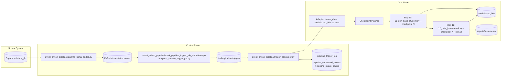
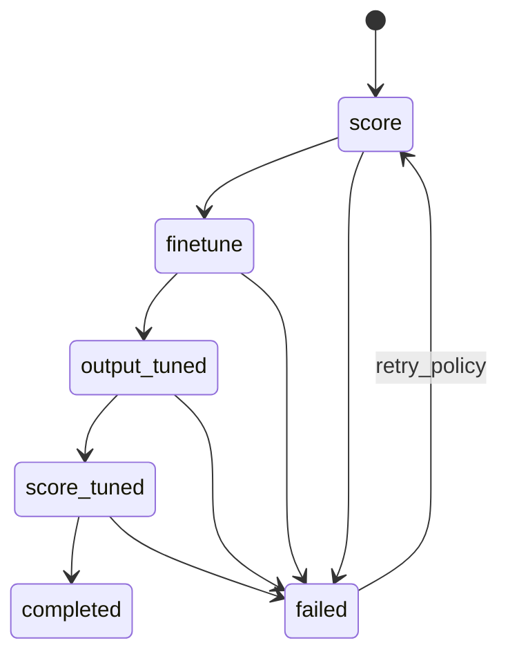
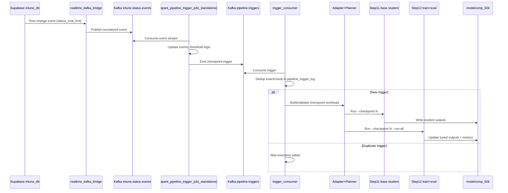

# Unified System Architecture: Event-Driven Intake + Incremental Checkpoint Learning

## Abstract
This document defines a unified architecture that merges:
1. Real-time, event-driven orchestration from `intune_db` changes, and
2. Deterministic checkpoint-based incremental learning on `modelcomp_50k`.

The architecture is designed for low trigger latency, high operational auditability, and bounded compute execution through checkpointed batch progression.

---

## 1. Problem Statement
The system must satisfy two constraints simultaneously:
- React quickly to data readiness transitions in `intune_db`.
- Preserve the controlled and measurable progression of checkpoint learning (`checkpoint = 1..N`) in `modelcomp_50k`.

A polling-only design increases database pressure and introduces trigger latency, while a pure stream-only design can weaken deterministic checkpoint accounting. The merged architecture resolves this by separating the control plane from the data plane.

---

## 2. Design Goals and Non-Goals
### Goals
- Sub-minute triggering from source-status transitions.
- Idempotent trigger execution under at-least-once delivery.
- Deterministic checkpoint lifecycle and status transitions.
- Clear failure isolation between ingestion, planning, and model stages.
- End-to-end observability from source event to checkpoint completion.

### Non-Goals
- Fully online model updates per single row event.
- Replacing checkpoint governance with unrestricted micro-batch training.
- Coupling realtime ingestion directly to GPU step internals.

---

## 3. Conceptual Model
### Control Plane
The control plane decides when and what to run:
- Event normalization and publication.
- Thresholding/window logic.
- Trigger deduplication and stage dispatch.

### Data Plane
The data plane executes heavy work:
- Dataset adaptation from source rows.
- Base student generation.
- Finetune and tuned evaluation.
- Metric/report persistence.

This separation keeps control logic fast and resilient while allowing long-running model stages to scale independently.

---

## 4. End-to-End Topology


---

## 5. Canonical State Machines
### 5.1 Source Readiness State (Operational Triggering)
`intune_db.status_eval_first` drives readiness signaling.

### 5.2 Checkpoint Learning State (Training Lifecycle)
Each checkpoint row in `modelcomp_50k` follows:



The lifecycle remains unchanged across the merge; this preserves comparability across historical runs.

---

## 6. Trigger Contract (Control/Data Boundary)
Recommended trigger payload:

```json
{
  "trigger_id": "uuid",
  "stage": "checkpoint_train_eval",
  "checkpoint": 2,
  "source_job": "standalone_processor",
  "dedupe_key": "ckpt_2_train_eval_20260323_101500",
  "trace_id": "optional-correlation-id"
}
```

### Contract Invariants
- `trigger_id` is globally unique.
- `dedupe_key` is deterministic for semantic duplicates.
- `checkpoint` is mandatory for checkpointed stages.
- Consumers must treat repeated messages as replay candidates, not new work.

---

## 7. Execution Semantics and Reliability
### Messaging Semantics
- Kafka topics provide ordered delivery within partition.
- Consumer path is at-least-once by design.
- Effective exactly-once stage execution is achieved via DB-backed idempotency (`pipeline_trigger_log`).

### Idempotency Strategy
- Before stage execution, attempt insert into trigger log with uniqueness guard.
- If insert fails as duplicate, acknowledge and skip execution.
- Offsets are committed only after durable trigger decision (executed or skipped-as-duplicate).

### Checkpoint Safety
- Stage handlers are checkpoint-scoped.
- Progress is externally visible in `modelcomp_50k` statuses.
- Recovery can continue from next unresolved status without replaying completed checkpoints.

---

## 8. Data Access and Performance Strategy
Recent optimization patterns are integral to the merged design:
- Keyset scanning (`id > last_seen_id`) for large table traversal.
- Local buffering and filtering for pending records.
- Retry wrappers for transient DB issues including statement timeout signatures.
- Batched updates/inference to constrain memory and transaction duration.

This avoids deep offset scans and reduces timeout probability on high-volume checkpoints.

---

## 9. Detailed Sequence (Merged Workflow)


---

## 10. Failure Domains and Recovery Playbook
| Failure Domain | Symptom | Containment | Recovery |
| --- | --- | --- | --- |
| Realtime bridge | Source changes not published | DLQ + producer error telemetry | Restart bridge, replay from source if needed |
| Spark processor | No trigger emission | Checkpointed streaming state | Resume job from checkpoint dir |
| Trigger consumer | Trigger lag/duplicates | Dedup table + manual commits | Restart consumer; duplicates skipped |
| Step 11/12 stage | Timeout / inference crash | Checkpoint status visibility | Retry failed status; rerun checkpoint stage |
| DB transient timeout | `57014` / timeout signatures | Retry backoff wrappers | Auto retry; escalate if repeated |

---

## 11. Observability and SLO Framework
### Suggested SLOs
- Trigger latency (source change -> trigger logged): p95 < 30s.
- Dispatch latency (trigger consume -> stage start): p95 < 10s.
- Checkpoint completion success rate: > 99% weekly.
- Duplicate execution rate: 0 (logical duplicates must be skipped).

### Core Signals
- Kafka consumer lag (`events`, `triggers`).
- Trigger insert outcomes (new vs duplicate).
- Checkpoint stage durations by `checkpoint` and `stage`.
- Failure counts by domain (bridge/spark/consumer/stage).

---

## 12. Deployment Topology Guidance
- Keep control plane services CPU-focused and independently autoscaled.
- Isolate GPU-intensive stage runners from trigger consumers.
- Persist Spark checkpoint directory on durable storage.
- Enforce schema/version compatibility for trigger payload evolution.

---

## 13. Implementation Checklist (Pragmatic)
1. Ensure `event_driven_pipeline/` services run with consistent env config.
2. Enable and validate pipeline metadata tables.
3. Implement/verify `checkpoint_train_eval` stage dispatch in consumer.
4. Validate idempotency under replay and consumer restarts.
5. Track SLO metrics for at least 24h shadow period before tightening thresholds.

---

## 14. Why This Architecture is Stable
The merged system preserves deterministic checkpoint governance while introducing low-latency event-driven triggering. Reliability is not delegated to any single component; it is composed from:
- durable messaging,
- idempotent trigger logging,
- explicit checkpoint state progression,
- and replay-safe stage execution.

This allows both scientific comparability (checkpointed experiments) and production responsiveness (near-real-time orchestration) without architectural conflict.
