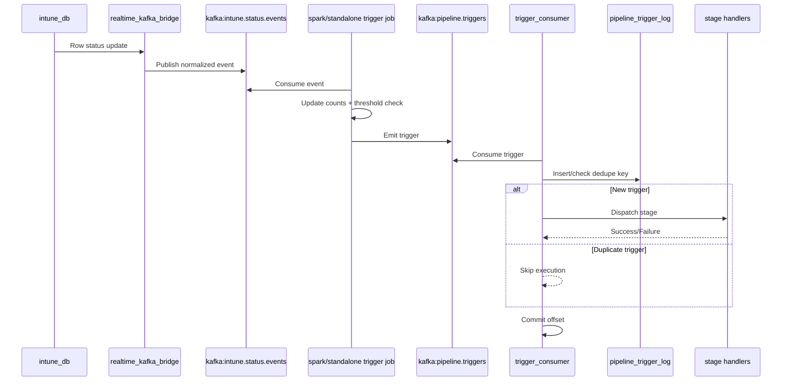

# Real-Time Streaming Architecture Implementation

## 0. Scope
This document provides an implementation-grade architecture for the realtime orchestration stack based on:
- Supabase Realtime events from `intune_db`
- Kafka transport and buffering
- Spark (or standalone processor) trigger generation
- Trigger consumer stage dispatch
- Integration with checkpointed incremental learning

It is the operational companion to `docs/merged_event_incremental_architecture.md`.

---

## 1. System Overview
### Before
- Polling loops in workers drove periodic checks.
- Trigger latency scaled with polling interval.
- Database load increased due to repetitive count queries.

### After
- Source mutations are streamed to Kafka immediately.
- Aggregation/threshold logic emits explicit trigger messages.
- Consumer executes stage handlers with idempotent dispatch and manual commit semantics.

```mermaid
flowchart LR
    A[(Supabase intune_db)] --> B[event_driven_pipeline/realtime_kafka_bridge.py]
    B --> C[(Kafka intune.status.events)]
    C --> D[event_driven_pipeline/spark_pipeline_trigger_job_standalone.py\n or spark_pipeline_trigger_job.py]
    D --> E[(Kafka pipeline.triggers)]
    E --> F[event_driven_pipeline/trigger_consumer.py]
    F --> G[Stage Handler: finetune_and_evaluate or checkpoint_train_eval]
    G --> H[(modelcomp_50k + reports)]
```



---

## 2. Component Contracts
## 2.1 `realtime_kafka_bridge.py`
Responsibilities:
- Subscribe to row-level change events in `intune_db`.
- Normalize event payload (`record_id`, changed statuses, timestamps).
- Publish to `intune.status.events`.
- Route failed deliveries to DLQ topic.

Contract:
- Never block source event ingestion on downstream model operations.
- Preserve source identifiers for traceability.

## 2.2 `spark_pipeline_trigger_job*.py`
Responsibilities:
- Consume `intune.status.events`.
- Maintain rolling state/counts for readiness condition.
- Emit triggers to `pipeline.triggers` once threshold and policy conditions are satisfied.
- Upsert current counts to `pipeline_status_counts`.

Contract:
- Trigger emission is deterministic for the configured policy window.
- Checkpoint state is externally checkpointed by Spark.

## 2.3 `trigger_consumer.py`
Responsibilities:
- Consume `pipeline.triggers`.
- Deduplicate via `pipeline_trigger_log`.
- Dispatch to stage handlers.
- Commit offsets after durable execution decision.

Contract:
- Logical duplicate messages must not cause duplicate stage execution.
- Every trigger results in one of: executed, skipped-duplicate, failed.

## 2.4 Stage Handlers
Current stage families:
- `finetune_and_evaluate`
- `checkpoint_train_eval`

`checkpoint_train_eval` path executes checkpoint-scoped incremental flow:
1. `11_gen_base_student.py --checkpoint N`
2. `12_train_incremental.py --checkpoint N --run-all`

---

## 3. Data Model and Metadata Tables
Required metadata tables:
- `pipeline_status_counts`: near-real-time aggregate view.
- `pipeline_trigger_log`: idempotent trigger execution log.
- `pipeline_consumed_events`: optional event-level dedupe/audit.

Recommended key constraints:
- Unique key on trigger identity (`trigger_id` and/or `dedupe_key`).
- Indexed lookup on recent trigger time and stage.

---

## 4. Trigger Schema
Recommended payload:

```json
{
  "trigger_id": "uuid",
  "stage": "checkpoint_train_eval",
  "checkpoint": 2,
  "source_job": "standalone_processor",
  "dedupe_key": "ckpt_2_train_eval_20260323_101500",
  "trace_id": "optional-correlation-id"
}
```

Rules:
- `trigger_id`: unique per emitted trigger event.
- `dedupe_key`: stable identifier for semantic duplicates.
- `checkpoint`: required for checkpoint stages.
- Unknown stages are rejected and logged.

---

## 5. Reliability Semantics
### Delivery and Processing
- Kafka provides at-least-once delivery to consumers.
- Consumer logic enforces exactly-once *effect* via idempotent trigger log insert/check.
- Manual offset commit occurs after trigger has a durable outcome.

### Replay Safety
- Re-reading a trigger message after restart is safe.
- Duplicate detection produces no-op execution for already handled work.

### Stage Safety
- Incremental stage scripts are checkpoint-scoped.
- Status progression in `modelcomp_50k` supports partial resume and retry.

---

## 6. Sequence: Realtime to Checkpoint Completion


---

## 7. Runtime Configuration
Core environment variables:

```bash
# Kafka
KAFKA_BOOTSTRAP_SERVERS=localhost:9092
KAFKA_TOPIC_EVENTS=intune.status.events
KAFKA_TOPIC_TRIGGERS=pipeline.triggers
KAFKA_TOPIC_DLQ=pipeline.dlq
KAFKA_GROUP_ID=pipeline-trigger-consumer

# Supabase
SUPABASE_URL=https://<project>.supabase.co
SUPABASE_KEY=<service-role-key>
REALTIME_SCHEMA=public
REALTIME_TABLE=intune_db

# Trigger Policy
TRIGGER_THRESHOLD=2

# Spark
SPARK_CHECKPOINT_DIR=/tmp/spark-checkpoints/pipeline

# Logging
LOG_LEVEL=INFO
```

---

## 8. Runbook
### 8.1 Prerequisites
```bash
pip install confluent-kafka pyspark supabase
psql -h <host> -U postgres -d postgres -f sql/05_schema_incremental_pipeline.sql
```

### 8.2 Start Services
Terminal 1:
```bash
python event_driven_pipeline/realtime_kafka_bridge.py
```

Terminal 2:
```bash
python event_driven_pipeline/spark_pipeline_trigger_job_standalone.py
```

(Or Spark variant)
```bash
spark-submit --packages org.apache.spark:spark-sql-kafka-0-10_2.12:3.4.0 event_driven_pipeline/spark_pipeline_trigger_job.py
```

Terminal 3:
```bash
python event_driven_pipeline/trigger_consumer.py
```

### 8.3 Manual Fallback
```bash
python event_driven_pipeline/trigger_consumer.py --manual --stage finetune_and_evaluate
```

---

## 9. Observability and SLOs
### Core Metrics
- Event ingest rate and bridge publish success.
- Event-to-trigger latency (p50, p95, p99).
- Trigger execution latency by stage.
- Consumer lag (`intune.status.events`, `pipeline.triggers`).
- Duplicate trigger skip rate.
- Checkpoint completion success ratio.

### Suggested SLO Targets
- Trigger emission latency p95 < 30s.
- Trigger dispatch latency p95 < 10s.
- Duplicate execution count = 0.
- Weekly stage success > 99%.

---

## 10. Failure Modes and Triage
| Symptom | Likely Domain | First Check | Primary Recovery |
| --- | --- | --- | --- |
| No events in Kafka | Bridge | bridge logs + Supabase connectivity | restart bridge, verify credentials |
| Events but no triggers | Spark/processor | threshold config + stream health | restart job from checkpoint |
| Triggers not executed | Consumer | group lag + trigger logs | restart consumer, inspect dedupe conflicts |
| Duplicate executions | Idempotency | unique constraints/log path | enforce trigger uniqueness + skip logic |
| Frequent DB timeout errors | Stage scripts | query patterns / batch sizing | keyset scan + retry/backoff tuning |

---

## 11. Scaling Model
### Horizontal Strategies
- Scale bridge instances by topic partitions.
- Scale consumers in same group for trigger throughput.
- Isolate stage execution workers from consumer process where GPU contention exists.

### Performance Tuning
- Kafka producer batching/compression.
- Spark micro-batch interval tuning.
- Controlled checkpoint batch sizes in stage scripts.

---

## 12. Security and Operations
Checklist:
- RLS and service-role handling policy validated.
- Kafka auth/TLS enabled in production.
- Secrets loaded from managed secret store.
- DLQ and alert rules configured.
- Audit retention policy for pipeline metadata tables.

---

## 13. Rollback Strategy
If event-driven path must be paused:
1. Stop bridge, processor, consumer.
2. Resume manual worker execution (`app/eval_finetune.py`) as interim mode.
3. Preserve Kafka offsets and trigger logs for controlled re-entry.

This rollback is operational, not destructive; metadata remains available for replay analysis.

---

## 14. Validation Plan
### Shadow Validation
- Run validator periodically:

```bash
python event_driven_pipeline/pipeline_validator.py
python event_driven_pipeline/pipeline_validator.py --status done
```

- Compare stream counts and source counts for 24h before tightening thresholds.

### Functional Validation
- Inject controlled status transitions.
- Verify trigger emission and exactly-once execution path.
- Verify checkpoint progression in `modelcomp_50k` and output artifact generation.

---

## 15. Expected Outcome
With the above implementation:
- Polling windows are removed from the critical trigger path.
- Triggering becomes near-real-time.
- Incremental training remains checkpoint-governed and auditable.
- Reliability improves via replay-safe, idempotent consumer design.
